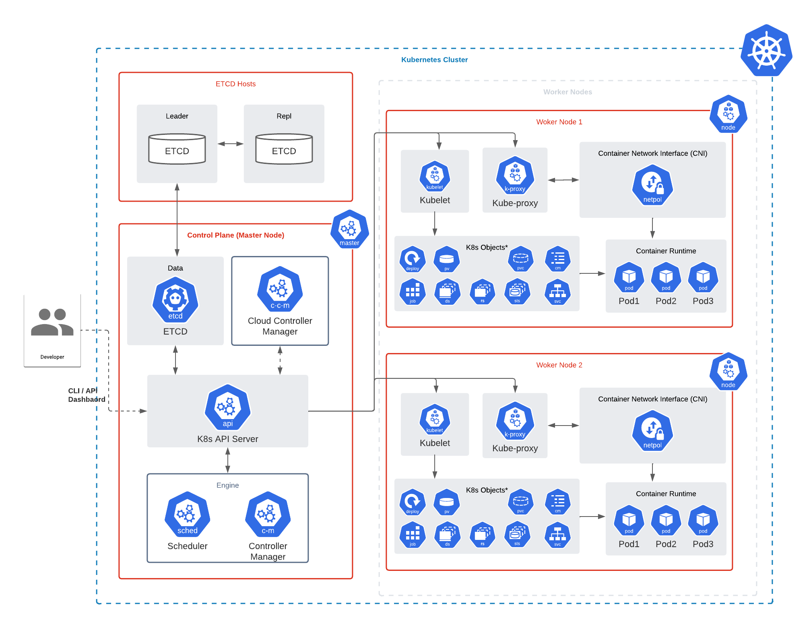
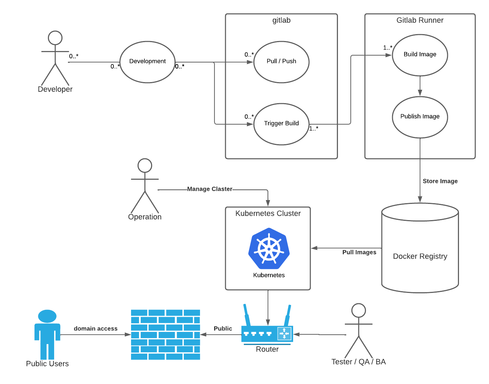

## Gitlab CI/CD Workflow

Gitlab mengediakan 2 workflow yaitu

- Continuous Integration / Continuous Delivery (CI/CD)
- GitOps (Pull request, Merge request)

Yang jadi pertanyaan kita harus pilih yang mana? Jawabannya `It's Depend, what you want todo!` kita bisa menggunakan CI/CD atau GitOps ataupun Combine between of them.

Untuk menggunakan workflow CI/CD temen-temen bisa menggunakan branch 

- `main`
- `feature/main` (development version)

Untuk menggunakan workflow GitOps temen-temen bisa menggunakan branch

- `gitlab-kas`
- `feature/gitlab-kas` (development version)

Semua branch di sertai dengan contoh penggunaanya, temen-temen bisa lihat pada folder `examples/<modules>`

## System requirement

Untuk menggunakan system ini ada beberapa hal yang harus temen-temen siapkan yaitu

- Gitlab CE/EE
- Gitlab Runner with container executor (docker, podman)
- Kubernetes Cluster
- Object storage (AWS s3, Google Cloud Storage, [min.io](https://min.io/))
- Files storage (NFS, Google Cloud Filestore, AWS fileshare, etc)

Jika kita gambarkan dengan diagram seperti berikut:

1. Kubernetes Cluster

    

2. DevOps Workflows

    

## Tech radar

Berikut adalah beberapa technology yang nantinya masih tetep digunakan, ditinggalkan, serta rencannya akan digunakan dimasa depan:

[click disini: tech-radar by thoughtwork](https://radar.thoughtworks.com/?sheetId=https%3A%2F%2Fraw.githubusercontent.com%2FdimMaryanto93%2Fgitlab-devops-automation%2Fgitlab-kas%2Fdevops-stack.json)