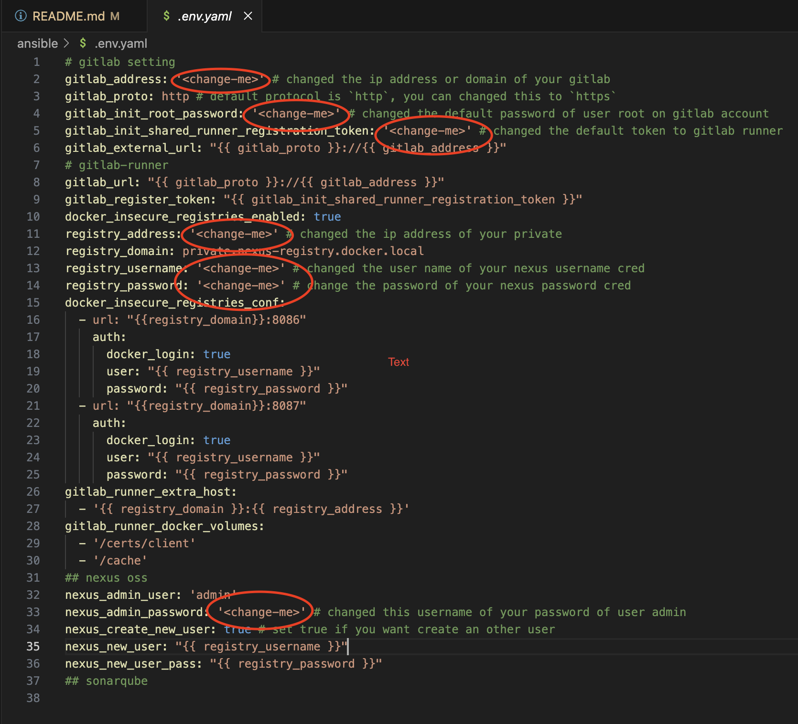

## Automation Deploy of DevSecOps Tools using Ansible playbook

Berikut adalah cara deploy DevSecOps tools menggunakan Ansible Playbook, Ada beberapa tools yang kita gunakan diantaranya:

- SourceCode Management: [Gitlab CE Edition](https://gitlab.com/rluna-gitlab/gitlab-ce)
- CI/CD Pipeline agent: [Gitlab Runner](https://docs.gitlab.com/runner/)
- executor: [Docker](https://www.docker.com/)
- Artifact and Container Registry: [Sonatype Nexus OSS](https://www.sonatype.com/products/sonatype-nexus-repository)
- Code Quality, Security & Static Analysis Tool: [Sonarqube](https://www.sonarsource.com/products/sonarqube/)
- Test Performance: [Apache JMeter](https://jmeter.apache.org/)
- OpenTelemetry Monitoring: [Signoz](https://signoz.io/)

Pertama kita install package ansible di laptop / Virtual Machine, Ansible ini akan digunakan untuk provision tools/software tersebut.

Untuk menggunakan ansible kita bisa pasang di Linux, MacOS dan Windows (WSL2)

```bash
# install for mac
brew install ansible

# install for ubuntu
apt-get install -y ansible

# install for centos
dnf/yum install -y ansible
```

Ref:
- [how to install ansible](https://docs.ansible.com/ansible/2.9/installation_guide/intro_installation.html)

## Preparation and Requirement

Ada beberapa hal yang perlu kita siapkan untuk meng-install tools DevSecOps tersebut diantaranya Virtual Machine dengan minimum specifikasi seperti berikut:

```yaml
gitlab:
    vms: 1
    cpus: 4 core
    ram: 8 GB
    os: OracleLinux 9.3
    network:
        type: static
        ip: 10.12.12.1 # contoh, silahkan sesuaikan dengan kondisi infra
        gw: 10.12.12.254
    storage: 
        partisions:
            "/": 50 GB
            "/var/opt": 100 GB
gitlab-runner:
    vms: at least 1, recommended 2
    cpus: 4 core
    ram: 8 GB
    os: CentOS 7
    network:
        type: static/dhcp
        ip: 10.12.12.xx # contoh, silahkan sesuaikan dengan kondisi infra
        gw: 10.12.12.254
    storage:
        partisions:
            "/": 30 GB
            "/var": 50 GB
nexus-oss:
    vm: 1
    cpus: 4 core
    ram: 8 GB
    os: OracleLinux 9.3
    network:
        type: static
        ip: 10.12.12.5 # contoh, silahkan sesuaikan dengan kondisi infra
        gw: 10.12.12.254
    storage:
        partisions:
            "/": 20 GB
            "/var/opt": at least 250 GB
sonarqube:
    vms: 1
    cpus: 4 cores
    ram: 8 GB
    os: OracleLinux 9.3
    network:
        type: static
        ip: 10.12.12.3 # contoh, silahkan sesuaikan dengan kondisi infra
        gw: 10.12.12.254
    storage:
        partisions:
            "/": 20 GB
            "/var": at least 80 GB
signoz:
    vms: 1
    cpus: 4 cores
    ram: 8 GB
    os: CentOS 7
    network:
        type: static
        ip: 10.12.12.3 # contoh, silahkan sesuaikan dengan kondisi infra
        gw: 10.12.12.254
    storage:
        partisions:
            "/": 20 GB
            "/var": at least 120 GB
jmeter:
    vms: at least 1
    cpus: 8 cores
    ram: 8 GB
    os: OracleLinux 9.3
    network:
        type: static
        ip: 10.12.12.6 # contoh, silahkan sesuaikan dengan kondisi infra
        gw: 10.12.12.254
    storage:
        partisions:
            "/": 50 GB
```

Dan menggunakan **credential yang sama** untuk memudahkan provision by ansible, setelah ter-deploy/provision kita bisa **ganti password yang lebih secure!!**

```yaml
username: admin
password: admin123!
```

seperti berikut:


## Using this Ansible Playbook

Pertama kita clone dulu repository ini, dengan perintah berikut:

```bash
git clone https://github.com/dimMaryanto93/gitlab-devops-automation.git --depth 1 && \
cd gitlab-devops-automation/ansible ## masuk ke folder ansible
```

Setelah itu kita perlu install dependency dengan menggunakan perintah berikut:

```bash
ansible-galaxy role install -r requirements.yaml --force && \
ansible-galaxy collection install -r requirements.yaml --force && \
cp .env.yaml extra-vars.yaml
```

Kemudian kita perlu edit pada file `extra-vars.yaml` seperti pada mark berikut:



Untuk provision perlu step-by-step flownya seperti berikut

- Setup commons task
- Install gitlab
- Install Nexus OSS & Configure registry
- Install gitlab-runner with docker executor
- Install sonarqube

### Setup auth to Ansible client

Auth need to be setup for all vms to communicate, to setup this you need [generate ssh private-public key](https://docs.github.com/en/authentication/connecting-to-github-with-ssh/generating-a-new-ssh-key-and-adding-it-to-the-ssh-agent)

Setelah kita buat, kita gunakan perintah `ssh-copy-id` kesetiap vm seperti berikut:

```bash
ssh-copy-id user@host-ip

# 💻 ~/D/p/n/g/ansible ➡  ssh-copy-id admin@10.12.20.51
# /usr/bin/ssh-copy-id: INFO: Source of key(s) to be installed: "/Users/dimasm93/.ssh/id_ed25519.pub"
# The authenticity of host '10.12.20.51 (10.12.20.51)' can't be established.
# ED25519 key fingerprint is SHA256:1W39EqeSK/qz1QBBcknpg+oVOahp7cvXm2vkOii3Opw.
# This host key is known by the following other names/addresses:
#    ~/.ssh/known_hosts:6: 10.12.11.234
# Are you sure you want to continue connecting (yes/no/[fingerprint])? yes
# /usr/bin/ssh-copy-id: INFO: attempting to log in with the new key(s), to filter out any that are already installed
# /usr/bin/ssh-copy-id: INFO: 1 key(s) remain to be installed -- if you are prompted now it is to install the new keys
# admin@10.12.20.51's password: ## enter your password
# Number of key(s) added:        1
# Now try logging into the machine, with:   "ssh 'admin@10.12.20.51'"
# and check to make sure that only the key(s) you wanted were added.

# 💻 ~/D/p/n/g/ansible ➡  ssh-copy-id admin@10.12.20.52
# admin@10.12.20.52's password: 
# Number of key(s) added:        1
# Now try logging into the machine, with:   "ssh 'admin@10.12.20.52'"

# 💻 ~/D/p/n/g/ansible ➡  ssh-copy-id admin@10.12.20.53
# admin@10.12.20.53's password: 
# Number of key(s) added:        1
# Now try logging into the machine, with:   "ssh 'admin@10.12.20.53'"

# 💻 ~/D/p/n/g/ansible ➡  ssh-copy-id admin@10.12.20.54
# admin@10.12.20.54's password: 
# Number of key(s) added:        1
# Now try logging into the machine, with:   "ssh 'admin@10.12.20.54'"

# 💻 ~/D/p/n/g/ansible ➡ ssh-copy-id admin@10.12.20.55
# admin@10.12.20.55's password: 
# Number of key(s) added:        1
# Now try logging into the machine, with:   "ssh 'admin@10.12.20.55'"
```

### Execute commons task

Ada beberapa hal yang dilakukan commons-task yaitu add qfcn ke file `/etc/hosts` dan upgrade system to latest serta install commons package dengan cara seperti berikut:

```bash
ansible-playbook -i inventory.ini --extra-vars='@extra-vars.yaml' common-tasks/site.yaml --ask-become-pass
```

Jika dijalankan outpunya seperti berikut:

```bash
💻 ~/D/p/n/g/ansible ➡ ansible-playbook -i inventory.ini --extra-vars='@extra-vars.yaml' common-tasks/site.yaml --ask-become-pass 
BECOME password: ## enter admin password for sudo access

playbook: common-tasks/site.yaml
  play #1 (all): Modify file /etc/hosts to add inventory ip     TAGS: []
    tasks:
      Add IP address of all hosts to all hosts  TAGS: []
      
PLAY RECAP ***********************************************************************************************************************************
gitlab-runner01_host       : ok=2    changed=0    unreachable=0    failed=0    skipped=0    rescued=0    ignored=0   
gitlab_host                : ok=2    changed=0    unreachable=0    failed=0    skipped=0    rescued=0    ignored=0   
jmeter_host                : ok=2    changed=1    unreachable=0    failed=0    skipped=0    rescued=0    ignored=0   
nexus-oss_host             : ok=2    changed=1    unreachable=0    failed=0    skipped=0    rescued=0    ignored=0   
sonarqube_host             : ok=2    changed=1    unreachable=0    failed=0    skipped=0    rescued=0    ignored=0
```

### Execute gitlab task

Pada task ini, fungsi utamanya adalah install gitlab dengan cara seperti berikut:

```bash
ansible-playbook -i inventory.ini ansible-playbook -i inventory.ini --extra-vars='@extra-vars.yaml' gitlab/site.yaml --ask-become-pass
```

Jika diexecute maka hasilnya seperti berikut:

```bash
💻 ~/D/p/n/g/ansible ➡ ansible-playbook -i inventory.ini --extra-vars='@extra-vars.yaml' gitlab/site.yaml --ask-become-pass  
BECOME password:

playbook: gitlab/site.yaml
  play #1 (gitlab): Install gitlab-ce   TAGS: []
    tasks:
      dimmaryanto93.gitlab : Load a variable file based on the OS type  TAGS: []
      dimmaryanto93.gitlab : Install dependencies     TAGS: []
      dimmaryanto93.gitlab : Check if GitLab configuration file already exists. TAGS: []
      dimmaryanto93.gitlab : Check if GitLab is already installed.      TAGS: []
      dimmaryanto93.gitlab : Download GitLab repository installation script.    TAGS: []
      dimmaryanto93.gitlab : Install GitLab repository. TAGS: []
      dimmaryanto93.gitlab : Install Gitlab     TAGS: []
      dimmaryanto93.gitlab : Reconfigure GitLab (first run).    TAGS: []
      dimmaryanto93.gitlab : get info init root password for gitlab     TAGS: []
      dimmaryanto93.gitlab : Debug root password        TAGS: []
      dimmaryanto93.gitlab : Setup firewall config TAGS: []

PLAY RECAP **************************************************************************************************************************************************************************************
gitlab_host                : ok=8    changed=4    unreachable=0    failed=0    skipped=5    rescued=0    ignored=0
```

Sekarang kita bisa login ke gitlab dengan menggunakan ip `10.12.12.1` login sebagai `root` dan passwordnya `passwordnyaR00t` seperti berikut:


### Execute Nexus OSS

Pada task ini, fungsi utamanya adalah untuk Install, Membuat docker registry repository, serta Membuat user, roles terkait specific authentication pada Nexus OSS.

Pertama kita jalankan dulu untuk install dengan script berikut:

```bash
ansible-playbook -i inventory.ini --extra-vars='@extra-vars.yaml' nexus-oss/site.yaml --ask-become-pass
```

Jika dijalankan maka hasilnya berikut:

```bash
💻 ~/D/p/n/g/ansible ➡ ansible-playbook -i inventory.ini --extra-vars='@extra-vars.yaml' nexus-oss/site.yaml --ask-become-pass
BECOME password: 

playbook: nexus-oss/site.yaml
  play #1 (nexus-oss): Install Nexus OSS        TAGS: []
    tasks:
      dimmaryanto93.sonatype_nexus_oss : Load a variable file based on the OS type      TAGS: []
      dimmaryanto93.sonatype_nexus_oss : Ensure group 'nexus' exists    TAGS: []
      dimmaryanto93.sonatype_nexus_oss : Add the user 'nexus' exists    TAGS: []
      dimmaryanto93.sonatype_nexus_oss : Create a directory ==> {{ nexus_installation_path }} if it does not exist      TAGS: []
      dimmaryanto93.sonatype_nexus_oss : Install OpenJDK 8      TAGS: []
      dimmaryanto93.sonatype_nexus_oss : Unarchive sonatype nexus-oss   TAGS: []
      dimmaryanto93.sonatype_nexus_oss : Give access to user 'nexus' recusively TAGS: []
      shell     TAGS: []
      dimmaryanto93.sonatype_nexus_oss : Create a symbolic link TAGS: []
      dimmaryanto93.sonatype_nexus_oss : Put SELinux in permissive mode TAGS: []
      dimmaryanto93.sonatype_nexus_oss : Setup firewall-cmd for RedHat family   TAGS: []
      dimmaryanto93.sonatype_nexus_oss : Setup ufw for Debian family    TAGS: []
      dimmaryanto93.sonatype_nexus_oss : nexus.service file     TAGS: []
      dimmaryanto93.sonatype_nexus_oss : Restart service nexus  TAGS: []

PLAY RECAP ***********************************************************************************************************************
nexus-oss_host             : ok=14   changed=11   unreachable=0    failed=0    skipped=1    rescued=0    ignored=0
```

Tunggu sampai `nexus.service` running, klo sudah bisa diakses dari browser dengan menggunakan url `10.12.12.5:8081` seperti berikut:


Sekarang login menggunakan user `admin` passwordnya ambil dari file `/opt/nexus/sonatype-work/nexus3/admin.password` klo sudah ganti passwordnya misalnya `passwordnyaR00t`. Klo sudah maka kita bisa execute script selanjutnya seperti berikut:

```bash
ansible-playbook -i inventory.ini --extra-vars='@extra-vars.yaml' nexus-oss/config-reg-docker.yaml --ask-become-pass
```

Outputnya seperti berikut:

```bash
💻 ~/D/p/n/g/ansible ➡ ansible-playbook -i inventory.ini --extra-vars='@extra-vars.yaml' nexus-oss/config-reg-docker.yaml --ask-become-pass
BECOME password: 

playbook: nexus-oss/config-reg-docker.yaml
  play #1 (nexus-oss): Setup registry for docker with custom user and roles     TAGS: []
    tasks:
      dimmaryanto93.sonatype_nexus_oss_registry : Setting host facts using complex arguments    TAGS: []
      dimmaryanto93.sonatype_nexus_oss_registry : Add realms docker allow to pull       TAGS: []
      dimmaryanto93.sonatype_nexus_oss_registry : Add docker registry to nexus-oss      TAGS: []
      dimmaryanto93.sonatype_nexus_oss_registry : Add new roles TAGS: []
      dimmaryanto93.sonatype_nexus_oss_registry : Add new users TAGS: []
      dimmaryanto93.sonatype_nexus_oss_registry : UFW allow port 8086/8087 tcp  TAGS: []
      dimmaryanto93.sonatype_nexus_oss_registry : firewall-cmd allow port 8086/8087 tcp TAGS: []

PLAY RECAP *********************************************************************************************************************************************************
nexus-oss_host             : ok=29   changed=1    unreachable=0    failed=0    skipped=1    rescued=0    ignored=0
```

Jika sudah maka sekarang beberapa repository baru akan terbentuk seperti berikut:


Dan juga user serta role baru akan terbuat seperti berikut:


### Execute gitlab-runner task

Pada task ini, fungsi utamanya adalah Install gitlab-runner, Install docker-ce, Registry gitlab-runner to gitlab as docker executor and login to private registry nexus oss. Kita bisa execute script berikut:

```bash
## install docker and gitlab-runner binnary
ansible-playbook -i inventory.ini --extra-vars='@extra-vars.yaml' gitlab-runner/site.yaml --ask-become-pass
## configure docker daemon.json and login to registry
ansible-playbook -i inventory.ini --extra-vars='@extra-vars.yaml' gitlab-runner/post-install.yaml --ask-become-pass
## register gitlab-runner to gitlab
ansible-playbook -i inventory.ini --extra-vars='@extra-vars.yaml' gitlab-runner/register-agent.yaml --ask-become-pass
```

Jika dijalankan output nya seperti berikut:

```bash
💻 ~/D/p/n/g/ansible ➡ ansible-playbook -i inventory.ini --extra-vars='@extra-vars.yaml' gitlab-runner/site.yaml --ask-become-pass
BECOME password:

playbook: gitlab-runner/site.yaml
  play #1 (gitlab-runner): Install gitlab-runner        TAGS: []
    tasks:
      dimmaryanto93.docker : Set selinux permissive module on RedHat family     TAGS: []
      dimmaryanto93.docker : Add firewall-cmd docker communication on RedHat family     TAGS: []
      dimmaryanto93.docker : Install dependencies    TAGS: []
      dimmaryanto93.docker : Add yum repository docker-ce    TAGS: []
      dimmaryanto93.docker : Install dockerd    TAGS: []
      dimmaryanto93.docker : Start docker daemon        TAGS: []
      dimmaryanto93.gitlab_runner : Load a variable file based on the OS type   TAGS: []
      dimmaryanto93.gitlab_runner : Check if gitlab-runner is already installed.        TAGS: []
      dimmaryanto93.gitlab_runner : Get latest gitlab repository installation script    TAGS: []
      dimmaryanto93.gitlab_runner : Install GitLab repository.  TAGS: []
      dimmaryanto93.gitlab_runner : Install gitlab-runner for Debian family     TAGS: []

PLAY RECAP ***********************************************************************************************************************
gitlab-runner01_host       : ok=14   changed=0    unreachable=0    failed=0    skipped=7    rescued=0    ignored=0

💻 ~/D/p/n/g/ansible ➡ ansible-playbook -i inventory.ini --extra-vars='@extra-vars.yaml' gitlab-runner/post-instal.yaml --ask-become-pass
BECOME password:

playbook: gitlab-runner/post-instal.yaml
  play #1 (gitlab-runner): Install gitlab-runner        TAGS: []
    tasks:
      dimmaryanto93.docker_post_install : Post-Install docker, executeable non-root     TAGS: []
      dimmaryanto93.docker_post_install : Create Directory '/etc/docker'        TAGS: []
      dimmaryanto93.docker_post_install : Set config global docker      TAGS: []
      dimmaryanto93.docker_post_install : Restart docker        TAGS: []
      dimmaryanto93.docker_post_install : Log into private registry and force re-authorization  TAGS: []
      Add IP address of all hosts to all hosts  TAGS: []

PLAY RECAP ***********************************************************************************************************************
gitlab-runner01_host       : ok=7    changed=2    unreachable=0    failed=0    skipped=0    rescued=0    ignored=0 

💻 ~/D/p/n/g/ansible ➡ ansible-playbook -i inventory.ini --extra-vars='@extra-vars.yaml' gitlab-runner/register-agent.yaml --ask-become-pass
BECOME password:

playbook: gitlab-runner/register-agent.yaml
  play #1 (gitlab-runner): Install gitlab-runner        TAGS: []
    tasks:
      dimmaryanto93.gitlab_runner_docker_executor : Gitlab verify       TAGS: []
      dimmaryanto93.gitlab_runner_docker_executor : Gitlab register docker executor     TAGS: []

PLAY RECAP ***********************************************************************************************************************
gitlab-runner01_host       : ok=3    changed=2    unreachable=0    failed=0    skipped=0    rescued=0    ignored=0  
```

Jika sudah selesai di execute maka, hasilnya gitlab sudah teregister di gitlab seperti berikut:


Setelah ini, kita set runner supaya bisa running tanpa `tags` pada `gitlab-ci.yml` seperti berikut:

