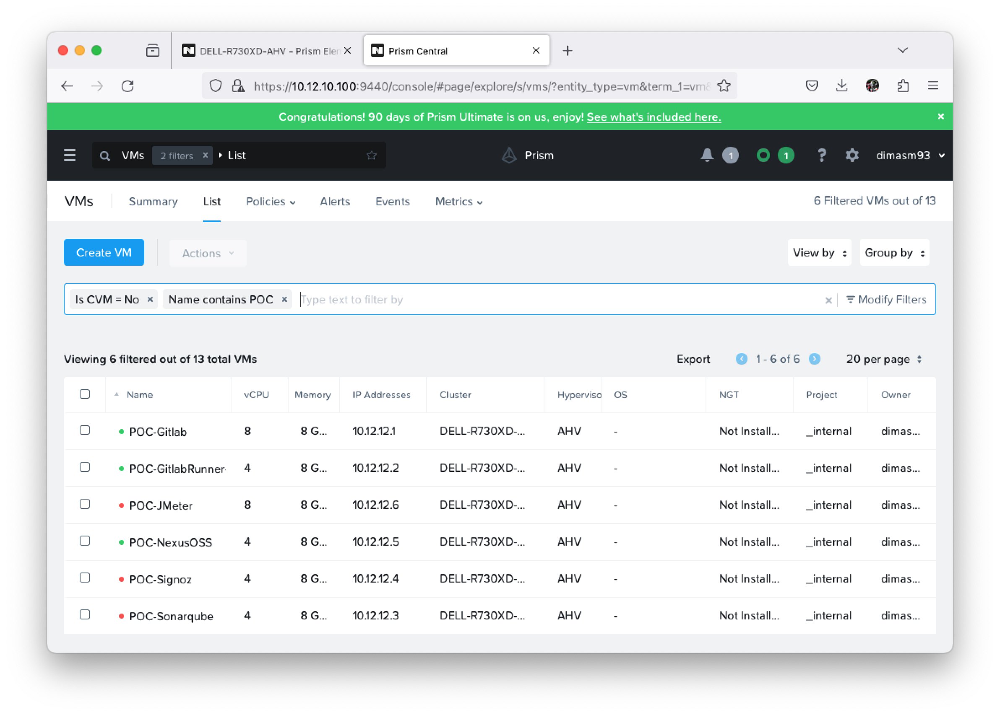
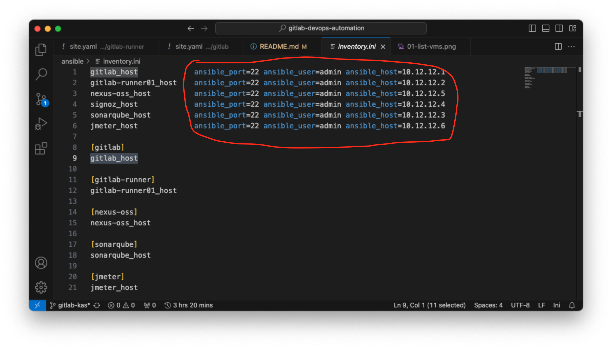
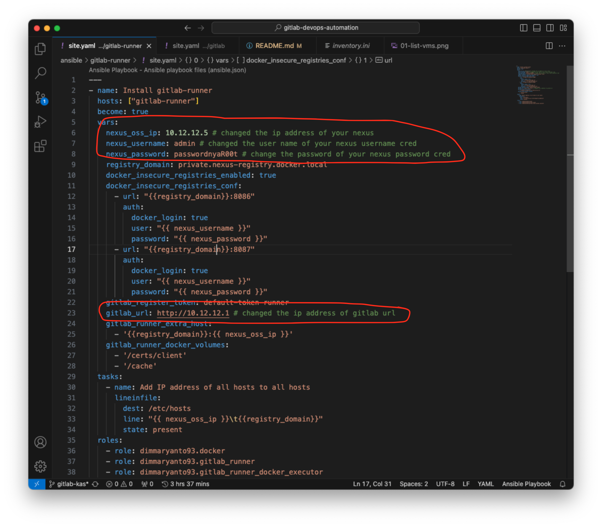
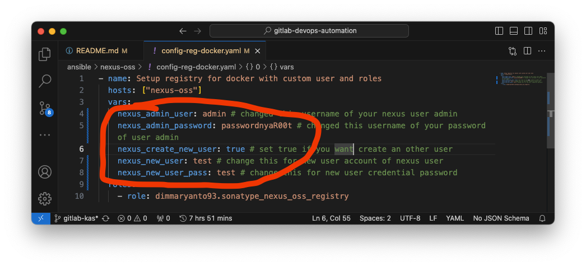
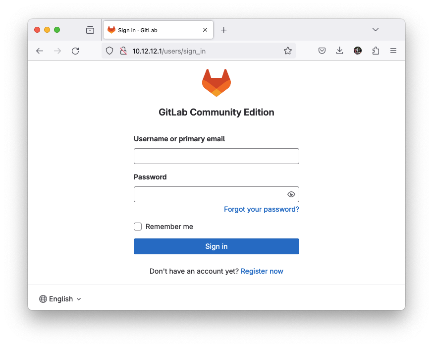
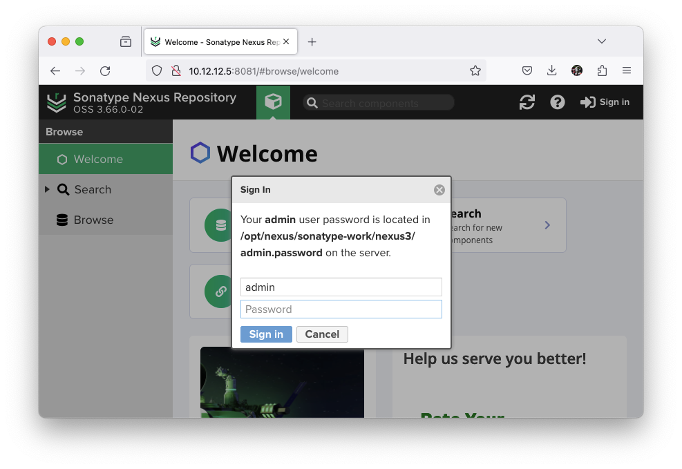
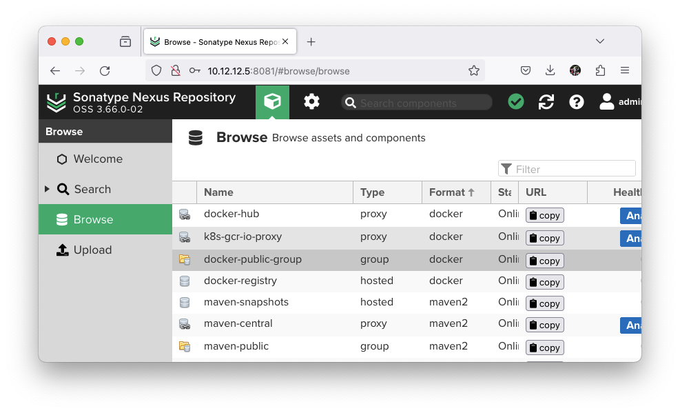
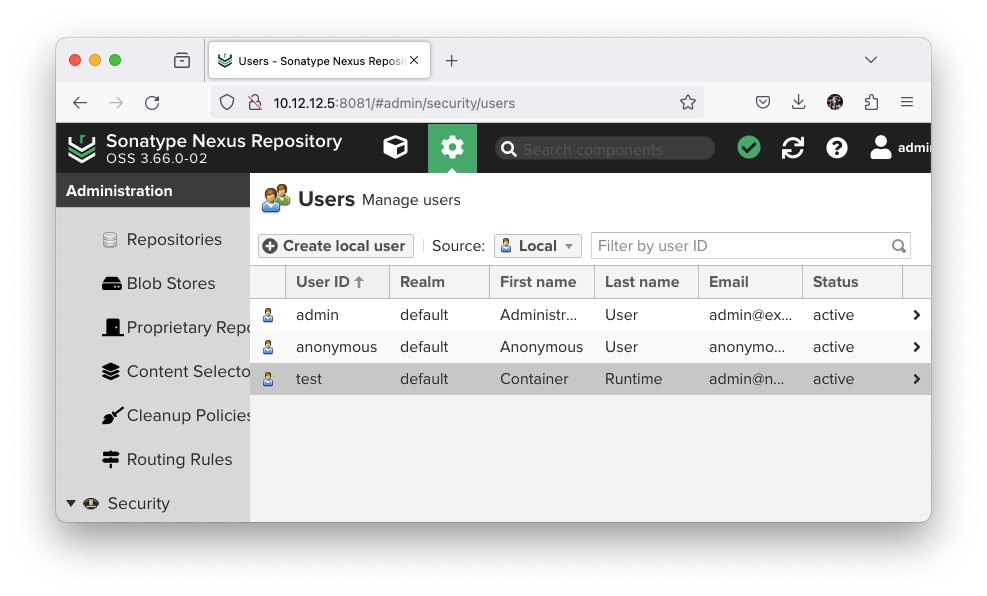
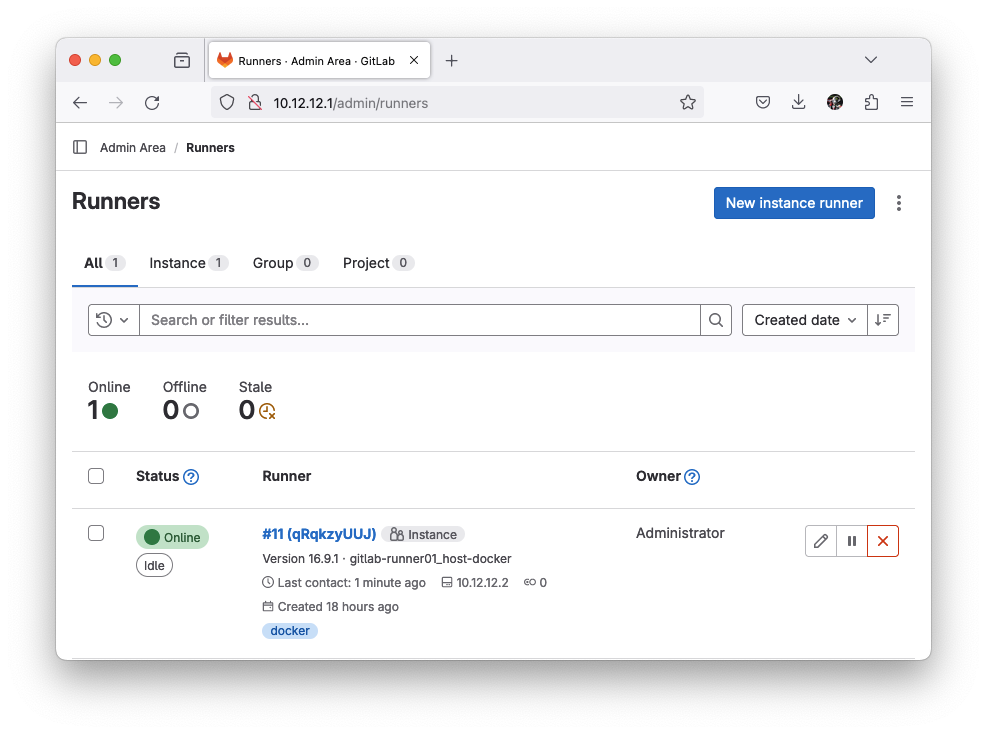
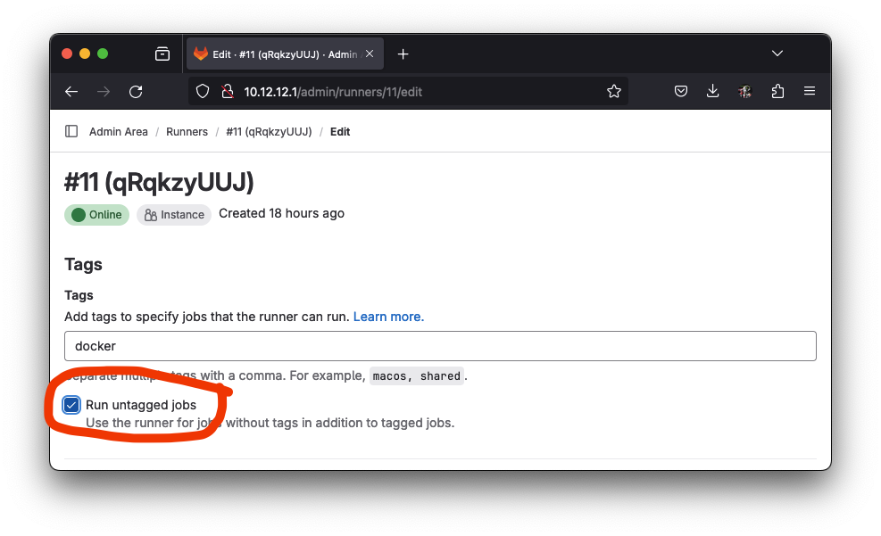

## Automation Deploy of DevSecOps Tools using Ansible playbook

Berikut adalah cara deploy DevSecOps tools menggunakan Ansible Playbook, Ada beberapa tools yang kita gunakan diantaranya:

- SourceCode Management: [Gitlab CE Edition](https://gitlab.com/rluna-gitlab/gitlab-ce)
- CI/CD Pipeline agent: [Gitlab Runner](https://docs.gitlab.com/runner/)
- executor: [Docker](https://www.docker.com/)
- Artifact and Container Registry: [Sonatype Nexus OSS](https://www.sonatype.com/products/sonatype-nexus-repository)
- Code Quality, Security & Static Analysis Tool: [Sonarqube](https://www.sonarsource.com/products/sonarqube/)
- Test Performance: [Apache JMeter](https://jmeter.apache.org/)
- OpenTelemetry Monitoring: [Signoz](https://signoz.io/)

Pertama kita install package ansible di laptop / Virtual Machine, Ansible ini akan digunakan untuk provision tools/software tersebut.

Untuk menggunakan ansible kita bisa pasang di Linux, MacOS dan Windows (WSL2)

```bash
# install for mac
brew install ansible

# install for ubuntu
apt-get install -y ansible

# install for centos
dnf/yum install -y ansible
```

Ref:
- [how to install ansible](https://docs.ansible.com/ansible/2.9/installation_guide/intro_installation.html)

## Preparation and Requirement

Ada beberapa hal yang perlu kita siapkan untuk meng-install tools DevSecOps tersebut diantaranya Virtual Machine dengan minimum specifikasi seperti berikut:

```yaml
gitlab:
    vms: 1
    cpus: 4 core
    ram: 8 GB
    os: OracleLinux 9.3
    network:
        type: static
        ip: 10.12.12.1 # contoh, silahkan sesuaikan dengan kondisi infra
        gw: 10.12.12.254
    storage: 
        partisions:
            "/": 50 GB
            "/var/opt": 100 GB
gitlab-runner:
    vms: at least 1, recommended 2
    cpus: 4 core
    ram: 8 GB
    os: CentOS 7
    network:
        type: static/dhcp
        ip: 10.12.12.xx # contoh, silahkan sesuaikan dengan kondisi infra
        gw: 10.12.12.254
    storage:
        partisions:
            "/": 30 GB
            "/var": 50 GB
nexus-oss:
    vm: 1
    cpus: 4 core
    ram: 8 GB
    os: OracleLinux 9.3
    network:
        type: static
        ip: 10.12.12.5 # contoh, silahkan sesuaikan dengan kondisi infra
        gw: 10.12.12.254
    storage:
        partisions:
            "/": 20 GB
            "/var/opt": at least 250 GB
sonarqube:
    vms: 1
    cpus: 4 cores
    ram: 8 GB
    os: OracleLinux 9.3
    network:
        type: static
        ip: 10.12.12.3 # contoh, silahkan sesuaikan dengan kondisi infra
        gw: 10.12.12.254
    storage:
        partisions:
            "/": 20 GB
            "/var": at least 80 GB
signoz:
    vms: 1
    cpus: 4 cores
    ram: 8 GB
    os: CentOS 7
    network:
        type: static
        ip: 10.12.12.3 # contoh, silahkan sesuaikan dengan kondisi infra
        gw: 10.12.12.254
    storage:
        partisions:
            "/": 20 GB
            "/var": at least 120 GB
jmeter:
    vms: at least 1
    cpus: 8 cores
    ram: 8 GB
    os: OracleLinux 9.3
    network:
        type: static
        ip: 10.12.12.6 # contoh, silahkan sesuaikan dengan kondisi infra
        gw: 10.12.12.254
    storage:
        partisions:
            "/": 50 GB
```

Dan menggunakan **credential yang sama** untuk memudahkan provision by ansible, setelah ter-deploy/provision kita bisa **ganti password yang lebih secure!!**

```yaml
username: admin
password: admin123!
```

seperti berikut:



## Using this Ansible Playbook

Pertama kita clone dulu repository ini, dengan perintah berikut:

```bash
git clone https://github.com/dimMaryanto93/gitlab-devops-automation.git --depth 1 && \
cd gitlab-devops-automation/ansible ## masuk ke folder ansible
```

Setelah itu kita perlu install dependency dengan menggunakan perintah berikut:

```bash
ansible-galaxy role install -r requirements.yaml --force && \
ansible-galaxy collection install -r requirements.yaml --force
```

Kemudian ada beberapa file yang perlu di edit seperti:

- `inventory.ini`, file ini digunakan untuk mendaftarkan ip, cred dari virtual machine yang akan di install tools tersebut seperti berikut:
    
- `gitlab/site.yaml`, file ini digunakan untuk memprovision tools gitlab dan perlu kita update beberapa value seperti `gitlab.rb` config seperti berikut:
    
- `gitlab-runner/site.yaml`, file ini digunakan untuk memprovision tools gitlab runner dan meregister agent ke gitlab. Jadi kita perlu update config sehingga bisa connect ke gitlab seperti berikut:
    
- `nexus-oss/config-reg-docker.yaml`, file ini digunakan untuk memprovision docker registry di nexus-oss. Jadi kita perlu update config sehingga bisa connect ke nexus-oss
    

Untuk provision perlu step-by-step flownya seperti berikut

- Setup commons task
- Install gitlab
- Install Nexus OSS & Configure registry
- Install gitlab-runner with docker executor
- Install sonarqube

## Setup auth to Ansible client

Auth need to be setup for all vms to communicate, to setup this you need [generate ssh private-public key](https://docs.github.com/en/authentication/connecting-to-github-with-ssh/generating-a-new-ssh-key-and-adding-it-to-the-ssh-agent)

Setelah kita buat, kita gunakan perintah `ssh-copy-id` kesetiap vm seperti berikut:

```bash
ssh-copy-id user@host-ip
# ex: ssh-copy-id admin@10.12.10.50
```

### Execute commons task

Ada beberapa hal yang dilakukan commons-task yaitu add qfcn ke file `/etc/hosts` dan upgrade system to latest serta install commons package dengan cara seperti berikut:

```bash
ansible-playbook -i inventory.ini common-tasks/site.yaml --ask-become-pass
```

Jika dijalankan outpunya seperti berikut:

```bash
~/D/p/n/g/ansible ➡ ansible-playbook -i inventory.ini common-tasks/site.yaml --ask-become-pass 
BECOME password: 
[WARNING]: Invalid characters were found in group names but not replaced, use -vvvv to see details

TASK [Add IP address of all hosts to all hosts] *************************************************************
ok: [gitlab_host] => (item=signoz_host)
changed: [gitlab-runner01_host] => (item=signoz_host)
changed: [nexus-oss_host] => (item=signoz_host)
ok: [gitlab_host] => (item=gitlab_host)
changed: [gitlab-runner01_host] => (item=gitlab_host)
ok: [gitlab_host] => (item=gitlab-runner01_host)
changed: [gitlab-runner01_host] => (item=gitlab-runner01_host)
changed: [nexus-oss_host] => (item=gitlab_host)
changed: [gitlab-runner01_host] => (item=nexus-oss_host)
ok: [gitlab_host] => (item=nexus-oss_host)
ok: [gitlab_host] => (item=sonarqube_host)
changed: [gitlab-runner01_host] => (item=sonarqube_host)
changed: [nexus-oss_host] => (item=gitlab-runner01_host)
ok: [gitlab_host] => (item=jmeter_host)
changed: [gitlab-runner01_host] => (item=jmeter_host)
changed: [nexus-oss_host] => (item=nexus-oss_host)
changed: [nexus-oss_host] => (item=sonarqube_host)
changed: [nexus-oss_host] => (item=jmeter_host)
```

### Execute gitlab task

Pada task ini, fungsi utamanya adalah install gitlab dengan cara seperti berikut:

```bash
ansible-playbook -i inventory.ini ansible-playbook -i inventory.ini gitlab/site.yaml --ask-become-pass
```

Jika diexecute maka hasilnya seperti berikut:

```bash
~/D/p/n/g/ansible ➡ ansible-playbook -i inventory.ini gitlab/site.yaml --ask-become-pass  
BECOME password:

PLAY RECAP **************************************************************************************************
gitlab_host                : ok=5    changed=1    unreachable=0    failed=0    skipped=7    rescued=0    ignored=0
```

Sekarang kita bisa login ke gitlab dengan menggunakan ip `10.12.12.1` login sebagai `root` dan passwordnya `passwordnyaR00t` seperti berikut:



### Execute Nexus OSS

Pada task ini, fungsi utamanya adalah untuk Install, Membuat docker registry repository, serta Membuat user, roles terkait specific authentication pada Nexus OSS.

Pertama kita jalankan dulu untuk install dengan script berikut:

```bash
ansible-playbook -i inventory.ini nexus-oss/site.yaml --ask-become-pass
```

Jika dijalankan maka hasilnya berikut:

```bash
💻 ~/D/p/n/g/ansible ➡ ansible-playbook -i inventory.ini nexus-oss/site.yaml --ask-become-pass                            -!?[📂 gitlab-kas]
BECOME password: 
[WARNING]: Invalid characters were found in group names but not replaced, use -vvvv to see details

PLAY [Install Nexus OSS] ********************************************************************************************************************

TASK [Gathering Facts] **********************************************************************************************************************
[WARNING]: Platform linux on host nexus-oss_host is using the discovered Python interpreter at /usr/bin/python3.9, but future installation
of another Python interpreter could change the meaning of that path. See https://docs.ansible.com/ansible-
core/2.16/reference_appendices/interpreter_discovery.html for more information.
ok: [nexus-oss_host]

TASK [dimmaryanto93.sonatype_nexus_oss : Load a variable file based on the OS type] *********************************************************
ok: [nexus-oss_host]

TASK [dimmaryanto93.sonatype_nexus_oss : Ensure group 'nexus' exists] ***********************************************************************
ok: [nexus-oss_host]

TASK [dimmaryanto93.sonatype_nexus_oss : Add the user 'nexus' exists] ***********************************************************************
[WARNING]: 'append' is set, but no 'groups' are specified. Use 'groups' for appending new groups.This will change to an error in Ansible
2.14.
ok: [nexus-oss_host]

TASK [dimmaryanto93.sonatype_nexus_oss : Create a directory ==> /opt/nexus if it does not exist] ********************************************
changed: [nexus-oss_host]

TASK [dimmaryanto93.sonatype_nexus_oss : Install OpenJDK 8] *********************************************************************************
ok: [nexus-oss_host]

TASK [dimmaryanto93.sonatype_nexus_oss : Unarchive sonatype nexus-oss] **********************************************************************
changed: [nexus-oss_host]

TASK [dimmaryanto93.sonatype_nexus_oss : Give access to user 'nexus' recusively] ************************************************************
changed: [nexus-oss_host]

TASK [dimmaryanto93.sonatype_nexus_oss : shell] *********************************************************************************************
changed: [nexus-oss_host]

TASK [dimmaryanto93.sonatype_nexus_oss : Create a symbolic link] ****************************************************************************
changed: [nexus-oss_host]

TASK [dimmaryanto93.sonatype_nexus_oss : Put SELinux in permissive mode] ********************************************************************
ok: [nexus-oss_host]

TASK [dimmaryanto93.sonatype_nexus_oss : Setup firewall-cmd for RedHat family] **************************************************************
ok: [nexus-oss_host]

TASK [dimmaryanto93.sonatype_nexus_oss : Setup ufw for Debian family] ***********************************************************************
skipping: [nexus-oss_host]

TASK [dimmaryanto93.sonatype_nexus_oss : nexus.service file] ********************************************************************************
ok: [nexus-oss_host]

TASK [dimmaryanto93.sonatype_nexus_oss : Restart service nexus] *****************************************************************************
changed: [nexus-oss_host]

PLAY RECAP **********************************************************************************************************************************
nexus-oss_host             : ok=14   changed=6    unreachable=0    failed=0    skipped=1    rescued=0    ignored=0
```

Tunggu sampai `nexus.service` running, klo sudah bisa diakses dari browser dengan menggunakan url `10.12.12.5:8081` seperti berikut:



Sekarang login menggunakan user `admin` passwordnya ambil dari file `/opt/nexus/sonatype-work/nexus3/admin.password` klo sudah ganti passwordnya misalnya `passwordnyaR00t`. Klo sudah maka kita bisa execute script selanjutnya seperti berikut:

```bash
ansible-playbook -i inventory.ini nexus-oss/config-reg-docker.yaml --ask-become-pass
```

Jika sudah maka sekarang beberapa repository baru akan terbentuk seperti berikut:



Dan juga user serta role baru akan terbuat seperti berikut:



### Execute gitlab-runner task

Pada task ini, fungsi utamanya adalah Install gitlab-runner, Install docker-ce, Registry gitlab-runner to gitlab as docker executor and login to private registry nexus oss. Kita bisa execute script berikut:

```bash
## install docker and gitlab-runner binnary
ansible-playbook -i inventory.ini gitlab-runner/site.yaml --ask-become-pass
## configure docker daemon.json and login to registry
ansible-playbook -i inventory.ini gitlab-runner/post-install.yaml --ask-become-pass
## register gitlab-runner to gitlab
ansible-playbook -i inventory.ini gitlab-runner/register-agent.yaml --ask-become-pass
```

Jika sudah selesai di execute maka, hasilnya gitlab sudah teregister di gitlab seperti berikut:



Setelah ini, kita set runner supaya bisa running tanpa `tags` pada `gitlab-ci.yml` seperti berikut:

