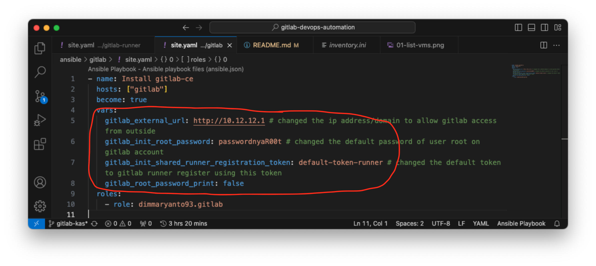

## Automation Deploy of DevSecOps Tools using Ansible playbook

Berikut adalah cara deploy DevSecOps tools menggunakan Ansible Playbook, Ada beberapa tools yang kita gunakan diantaranya:

- SourceCode Management: [Gitlab CE Edition](https://gitlab.com/rluna-gitlab/gitlab-ce)
- CI/CD Pipeline agent: [Gitlab Runner](https://docs.gitlab.com/runner/)
- executor: [Docker](https://www.docker.com/)
- Artifact and Container Registry: [Sonatype Nexus OSS](https://www.sonatype.com/products/sonatype-nexus-repository)
- Code Quality, Security & Static Analysis Tool: [Sonarqube](https://www.sonarsource.com/products/sonarqube/)
- Test Performance: [Apache JMeter](https://jmeter.apache.org/)
- OpenTelemetry Monitoring: [Signoz](https://signoz.io/)

Pertama kita install package ansible di laptop / Virtual Machine, Ansible ini akan digunakan untuk provision tools/software tersebut.

Untuk menggunakan ansible kita bisa pasang di Linux, MacOS dan Windows (WSL2)

```bash
# install for mac
brew install ansible

# install for ubuntu
apt-get install -y ansible

# install for centos
dnf/yum install -y ansible
```

Ref:
- [how to install ansible](https://docs.ansible.com/ansible/2.9/installation_guide/intro_installation.html)

## Preparation and Requirement

Ada beberapa hal yang perlu kita siapkan untuk meng-install tools DevSecOps tersebut diantaranya Virtual Machine dengan minimum specifikasi seperti berikut:

```yaml
gitlab:
    vms: 1
    cpus: 4 core
    ram: 8 GB
    os: OracleLinux 9.3
    network:
        type: static
        ip: 10.12.12.1 # contoh, silahkan sesuaikan dengan kondisi infra
        gw: 10.12.12.254
    storage: 
        partisions:
            "/": 50 GB
            "/var/opt": 100 GB
gitlab-runner:
    vms: at least 1, recommended 2
    cpus: 4 core
    ram: 8 GB
    os: CentOS 7
    network:
        type: static/dhcp
        ip: 10.12.12.xx # contoh, silahkan sesuaikan dengan kondisi infra
        gw: 10.12.12.254
    storage:
        partisions:
            "/": 30 GB
            "/var": 50 GB
nexus-oss:
    vm: 1
    cpus: 4 core
    ram: 8 GB
    os: OracleLinux 9.3
    network:
        type: static
        ip: 10.12.12.5 # contoh, silahkan sesuaikan dengan kondisi infra
        gw: 10.12.12.254
    storage:
        partisions:
            "/": 20 GB
            "/var/opt": at least 250 GB
sonarqube:
    vms: 1
    cpus: 4 cores
    ram: 8 GB
    os: OracleLinux 9.3
    network:
        type: static
        ip: 10.12.12.3 # contoh, silahkan sesuaikan dengan kondisi infra
        gw: 10.12.12.254
    storage:
        partisions:
            "/": 20 GB
            "/var": at least 80 GB
signoz:
    vms: 1
    cpus: 4 cores
    ram: 8 GB
    os: CentOS 7
    network:
        type: static
        ip: 10.12.12.3 # contoh, silahkan sesuaikan dengan kondisi infra
        gw: 10.12.12.254
    storage:
        partisions:
            "/": 20 GB
            "/var": at least 120 GB
jmeter:
    vms: at least 1
    cpus: 8 cores
    ram: 8 GB
    os: OracleLinux 9.3
    network:
        type: static
        ip: 10.12.12.6 # contoh, silahkan sesuaikan dengan kondisi infra
        gw: 10.12.12.254
    storage:
        partisions:
            "/": 50 GB
```

Dan menggunakan **credential yang sama** untuk memudahkan provision by ansible, setelah ter-deploy/provision kita bisa **ganti password yang lebih secure!!**

```yaml
username: admin
password: admin123!
```

seperti berikut:


## Using this Ansible Playbook

Pertama kita clone dulu repository ini, dengan perintah berikut:

```bash
git clone https://github.com/dimMaryanto93/gitlab-devops-automation.git --depth 1 && \
cd gitlab-devops-automation/ansible ## masuk ke folder ansible
```

Setelah itu kita perlu install dependency dengan menggunakan perintah berikut:

```bash
ansible-galaxy role install -r requirements.yaml --force && \
ansible-galaxy collection install -r requirements.yaml --force
```

Kemudian ada beberapa file yang perlu di edit seperti:

- `inventory.ini`, file ini digunakan untuk mendaftarkan ip, cred dari virtual machine yang akan di install tools tersebut seperti berikut:
    
- `gitlab/site.yaml`, file ini digunakan untuk memprovision tools gitlab dan perlu kita update beberapa value seperti `gitlab.rb` config seperti berikut:
    
- `gitlab-runner/site.yaml`, file ini digunakan untuk memprovision tools gitlab runner dan meregister agent ke gitlab. Jadi kita perlu update config sehingga bisa connect ke gitlab seperti berikut:
    
- `nexus-oss/config-reg-docker.yaml`, file ini digunakan untuk memprovision docker registry di nexus-oss. Jadi kita perlu update config sehingga bisa connect ke nexus-oss
    

