For using GitOps with Gitlab + Kubernetes (fluxcd)

Berikut yang harus disiapkan, untuk meng-enable GitOps flow dengan fluxcd menggunakan Gitlab

- Fluxcd (install on your machine / vm)
    - helm
    - git
    - kubectl
- Kubernetes Cluster
- Gitlab with KAS Server enable (ensure config on `/etc/gitlab/gitlab.rb` enable `gitlab_kas => true`)

## Install fluxcd

For mac os, you can use homebrew

```bash
brew install fluxcd/tap/flux
```

For linux, you can use curl

```bash
curl -s https://fluxcd.io/install.sh | sudo bash
```

verify installation

```bash
flux --version
```

## Bootstrap fluxcd on gitlab repository

Pertama buat dulu repository di gitlab, contohnya disini saya membuat repository dengan nama `k8s-fluxcd-multicluster` dalam group `examples` seperti berikut

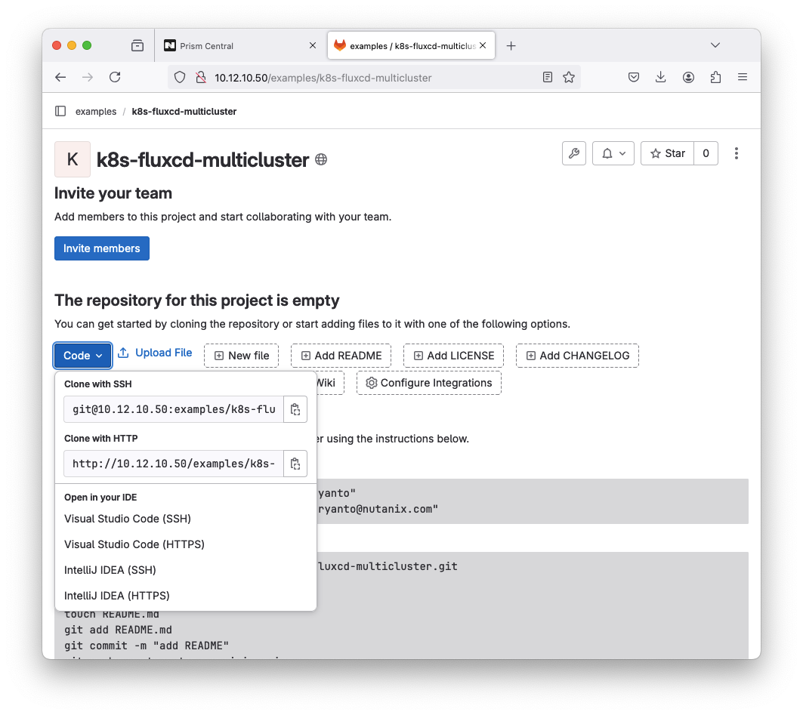

Kemudian, gunakan file `kubeconfig.conf` untuk konek ke kubernetes yang telah kita deploy sebelumnya  

```bash
💻 ~ ➡ export KUBECONFIG=~/Downloads/devsecops-dev-kubectl.cfg
💻 ~ ➡ kubectl get node

NAME                            STATUS   ROLES                  AGE   VERSION
devsecops-dev-7fca35-master-0   Ready    control-plane,master   9d    v1.25.6
devsecops-dev-7fca35-worker-0   Ready    node                   9d    v1.25.6
```

copy repository url dengan protocol **http** dan masukan di perintah berikut:

```bash
flux bootstrap git \                                           
--url="http://10.12.10.50/examples/k8s-fluxcd-multicluster.git" \
--token-auth \
--insecure-skip-tls-verify \
--username=dimasm93 \
--allow-insecure-http=true \
--path="./clusters/review"
```

Jika diexecute, hasilnya seperti berikut:

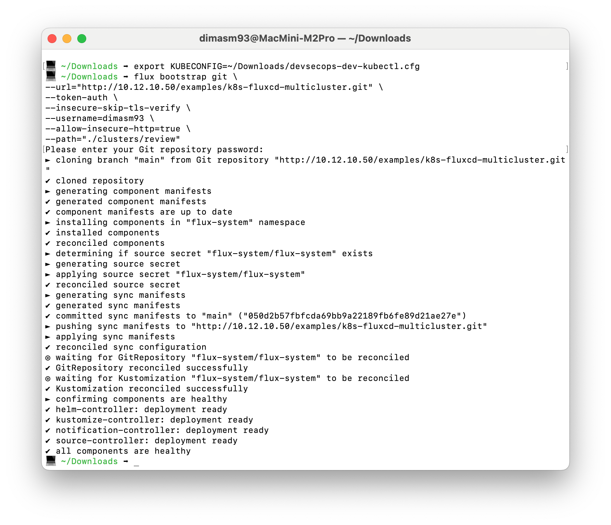

Kemudian coba check di kubernetes cluster tersebut, pod pada namespace `flux-system` seperti berikut

```bash
kubectl get pod -n flux-system
```

Sampai semuanya pod running, seperti berikut outputnya

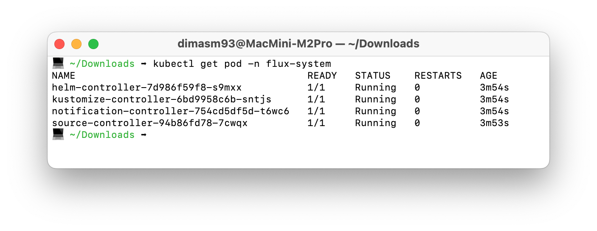

Kemudian check juga di repositorynya sampai terupdate seperti berikut:

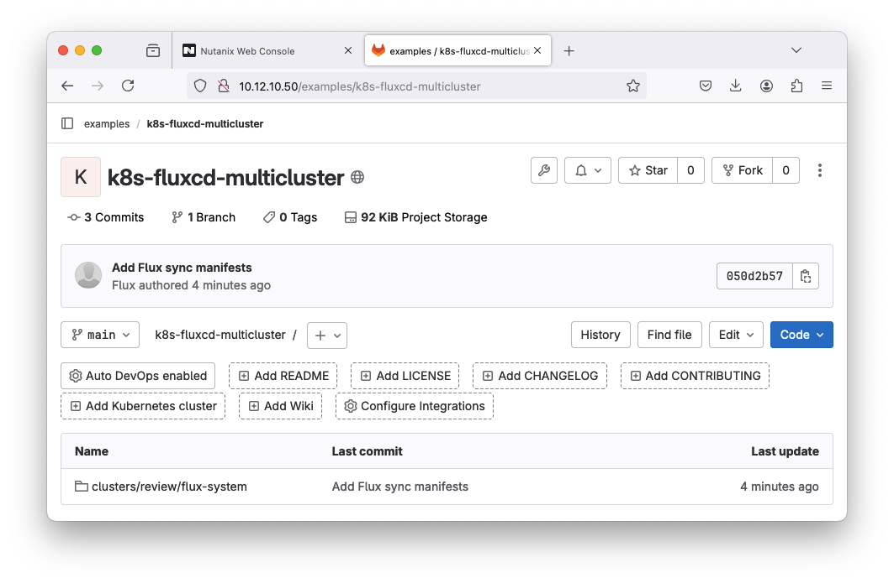

## To connect a Kubernetes cluster to GitLab

Before you can install the agent in your cluster, you need:

An existing Kubernetes cluster. If you don't have a cluster, you can create one on a cloud provider, like:

- Google Kubernetes Engine (GKE)
- Amazon Elastic Kubernetes Service (EKS)
- Digital Ocean

On self-managed GitLab instances, a GitLab administrator must set up the
agent server. In `gitlab.rb` when `external_url` property look like

```rb
external_url 'https://domain.example.com'
```

Then it is available by default at `wss://domain.example.com/-/kubernetes-agent/`. The agent server is available at `wss://domain.example.com`.

ref: 
- https://docs.gitlab.com/ee/user/clusters/agent/install/

## Create an agent configuration file

After `gitlab_kas` enabled, then we need configure file using a YAML file in the GitLab project/repository.

To create an agent configuration file:

1. Choose a name for your agent. The agent name follows the [DNS label standard from RFC 1123](https://www.rfc-editor.org/rfc/rfc1123). The name must:
    - Be unique in the project.
    - Contain at most 63 characters.
    - Contain only lowercase alphanumeric characters or -.
    - Start with an alphanumeric character.
    - End with an alphanumeric character.
2. In the repository, in the default branch, create this directory at the root:

    ```bash
    .gitlab/agents/<agent-name>
    ```

3. In the directory, create a `config.yaml` file. Ensure the filename ends in `.yaml`, not `.yml`.

You can leave the file blank for now, and commit & push.

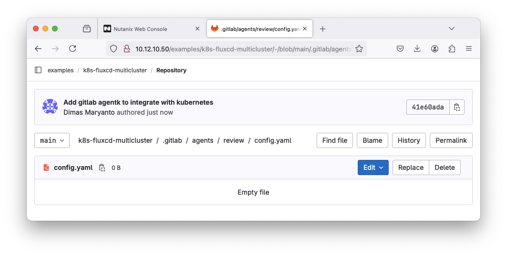

## Register `agentk` on gitlab

You must register an agent before you can install the agent in your cluster. To register an agent:

1. On the top bar, select **Main menu > Projects** and find your project. If you have an agent configuration file, it must be in this project. Your cluster manifest files should also be in this project.

2. From the left sidebar, select **Infrastructure > Kubernetes clusters**.
    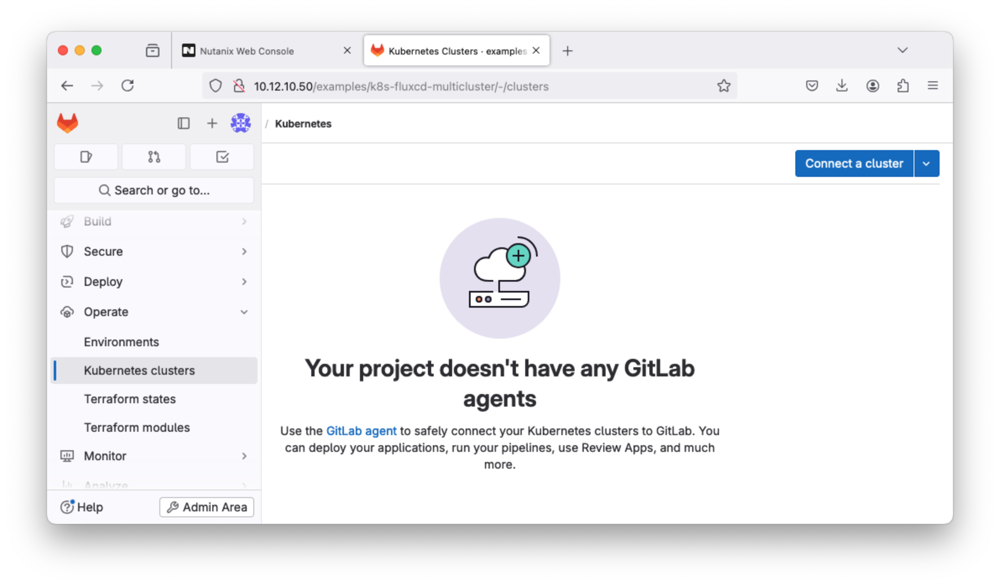

3. Select Connect a cluster (agent). then select agent-name has been created before
    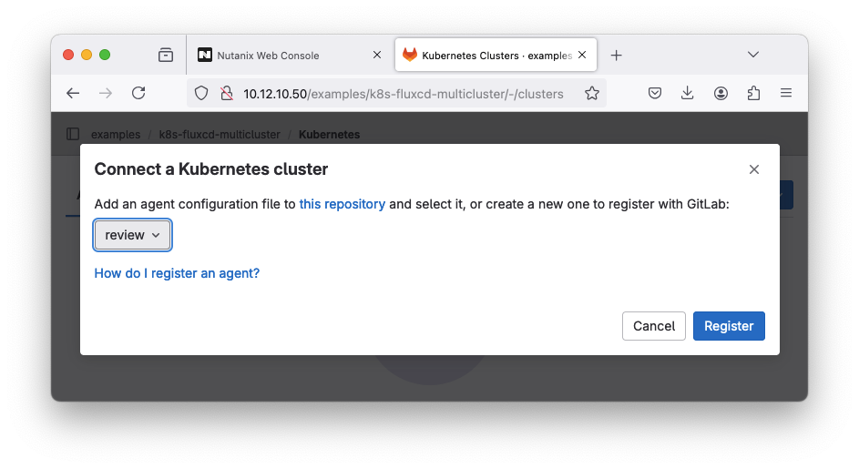

4. Click button Register. GitLab generates an access token for the agent. You need this token to install the agent in your cluster.
    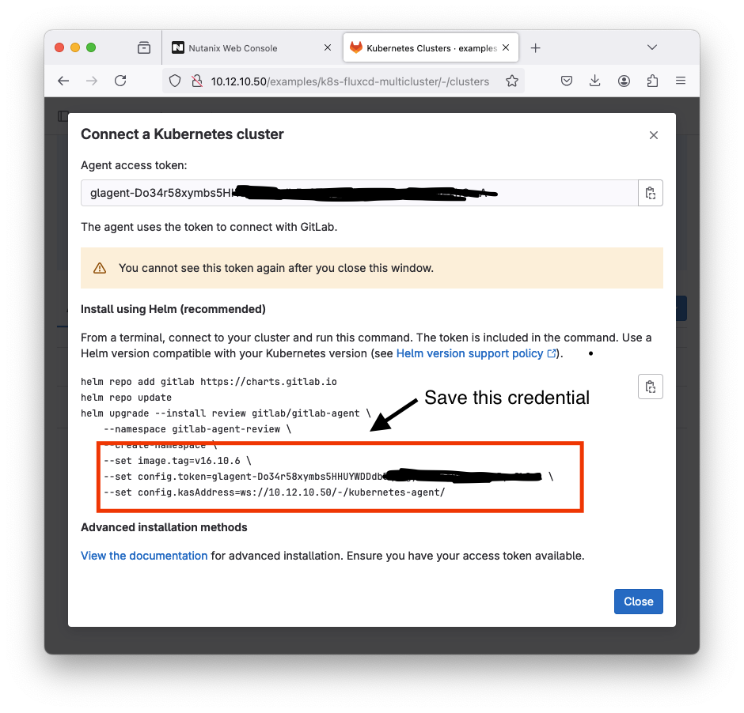

5. Securely store the agent `access token` and `kasAddress` for later.

## Install `agentk` on kubernetes cluster

use Flux to create a namespace for `agentk` and install it in your cluster. Keep in mind it takes a few minutes for Flux to pick up and apply configuration changes defined in the repository (`k8s-fluxcd-multicluster` repo).

1. Commit and push the following file to `clusters/review/namespace-gitlab.yaml`:
    ```yaml
    apiVersion: v1
    kind: Namespace
    metadata:
        name: gitlab
    ```

    after fluxcd apply this manifest, it will create namespace `gitlab`

    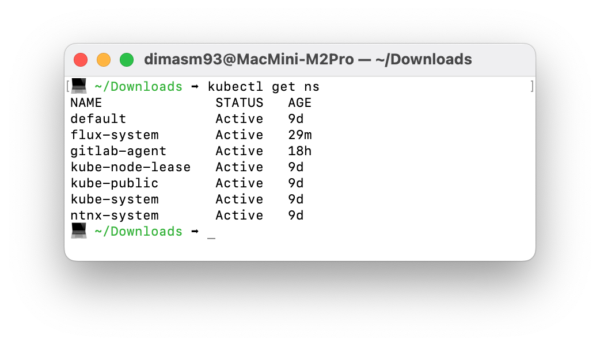

2. Create a file called `secret-gitlab-agentk.yaml` that contains your agent access token as a secret:
    ```yaml
    apiVersion: v1
    kind: Secret
    metadata:
        name: gitlab-agent-token
        namespace: gitlab
    type: Opaque
    stringData:
        token: "<your-gitlab-kubernetes-agentk-token>"
    ```

    Then apply manualy using `kubectl apply -f secret-gitlab-agentk.yaml`

3. Commit and push the following file to `clusters/review/gitlab-agentk.yaml`, replacing the values of `.spec.values.config.kasAddress` and `.spec.values.config.secretName` with your saved `kas address` and `secret name`:

    ```yaml
    ---
    apiVersion: source.toolkit.fluxcd.io/v1beta2
    kind: HelmRepository
    metadata:
        labels:
            app.kubernetes.io/component: agentk
            app.kubernetes.io/created-by: gitlab
            app.kubernetes.io/name: agentk
            app.kubernetes.io/part-of: gitlab
        name: gitlab-agent
        namespace: gitlab
    spec:
        interval: 1h0m0s
        url: https://charts.gitlab.io
    ---
    apiVersion: helm.toolkit.fluxcd.io/v2beta1
    kind: HelmRelease
    metadata:
        name: gitlab-agent
        namespace: gitlab
    spec:
        chart:
            spec:
                chart: gitlab-agent
                sourceRef:
                    kind: HelmRepository
                    name: gitlab-agent
                    namespace: gitlab
        interval: 1h0m0s
        values:
            config:
            kasAddress: "<changed-this-with-kas-address>"
            secretName: gitlab-agent-token
    ```

4. Check the pod, are all running using `kubectl get pod -n gitlab` and check the logs using `kubectl -n gitlab logs <pod-gitlab-agent-v2-xxxx>` makesure the log no error message look like this:

    ```bash
    💻 ~/Downloads ➡ kubectl -n gitlab logs gitlab-agent-v2-9c46c4845-4d5v7
    {"level":"info","time":"2024-07-15T09:05:22.124Z","msg":"Observability endpoint is up","mod_name":"observability","net_network":"tcp","net_address":"[::]:8080"}
    ```

If you found error message look like `agentk2kas_tunnel => Error handling a connection` just ignored, the functional may steel running. 

    ```bash
    💻 ~/Downloads ➡ kubectl -n gitlab logs gitlab-agent-v2-9c46c4845-4d5v7
    {"level":"error","time":"2024-07-15T11:02:51.575Z","msg":"Error handling a connection","mod_name":"agentk2kas_tunnel","error":"rpc error: code = Unavailable desc = error reading from server: failed to get reader: failed to read frame header: EOF"}
    ```

If you found error message look like `WebSocket dial failed to send handshake`:

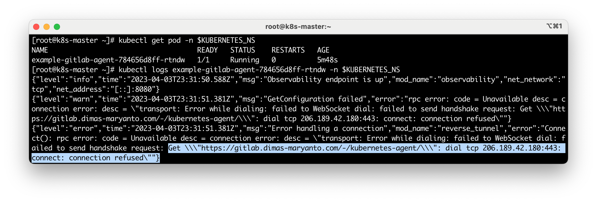

May you need add `spec.hostAlias` inside deployment object, then update the spec using command `kubectl edit deploy $PROJECT_NAME-gitlab-agent -n $KUBERNETES_NS` add this line:

```yaml
apiVersion: apps/v1
    kind: Deployment
    metadata:
        name: example-gitlab-agent
        namespace: gitlab-agent
spec:
    template:
        spec:
            hostAliases:
            - ip: "192.168.88.5"
              hostnames:
              - "gitlab.dimas-maryanto.com"
```

Quit and save, then you need check again the logs

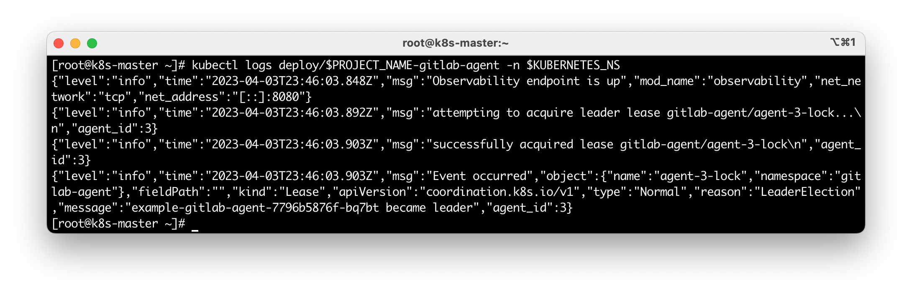

And finaly check the kubernetes cluster connection

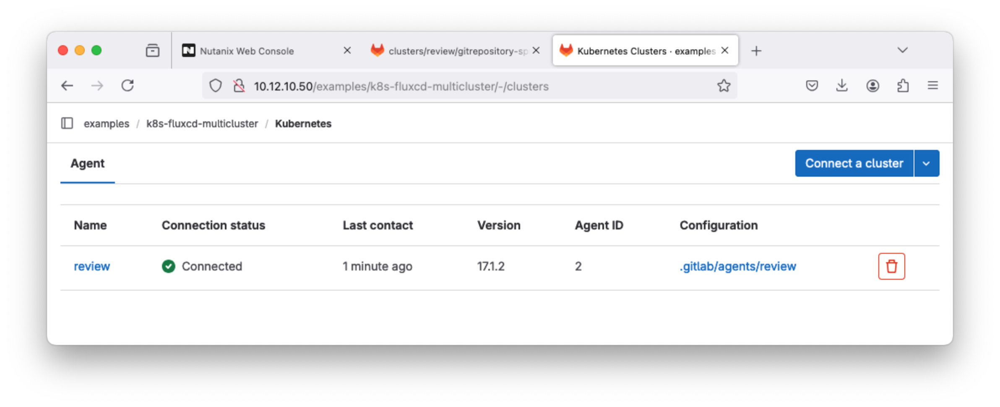

## Example deploy private repository

For example we have a private repository stored on gitlab with diffrent repository whichis on `examples/devsecops/springboot3-devsecops/` with branch `k8s-review` look like 

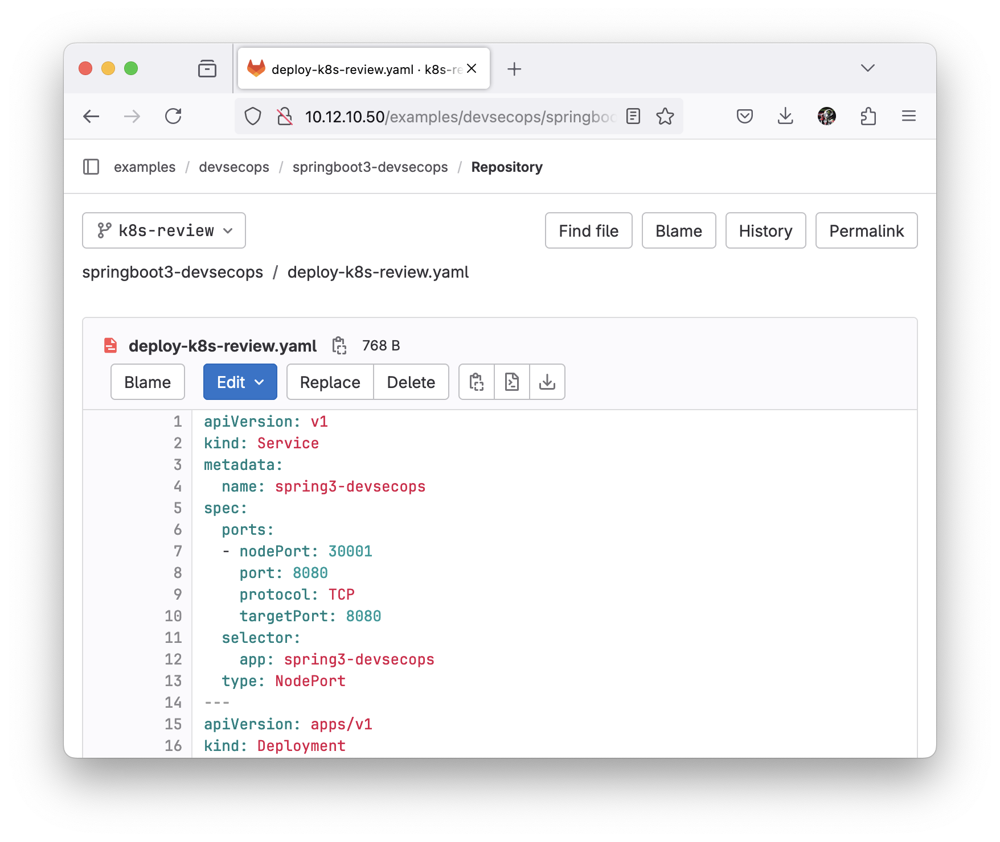

To deploy that kubernetes manifest using gitlab-fluxcd, you will need create some kubernetes resource 

- Secret (the credential to clone/pull from git operator)
- source.toolkit.fluxcd.io/v1 GitRepository (stored in your `k8s-fluxcd-multicluster` repository on `clusters/<environment>`)
- kustomize.toolkit.fluxcd.io/v1 Kustomization (stored in your `k8s-fluxcd-multicluster` repository on `cluster/<environment>`)

For the secret, just create local file called `git-secret-cred.yaml`

```yaml
---
apiVersion: v1
kind: Secret
metadata:
  name: gitlab-login
  namespace: flux-system
type: Opaque
data:
  username: <BASE64>
  password: <BASE64>
```

because, we are using http to clone the source-code (kubernetes manifest) from gitlab please use this template secret and execute using `kubectl apply -f git-secret-cred.yaml`

fill the `username` dan `password` with your gitlab credential or personal access token with scope `[api, write-repository, read-repository, admin]` the encoded with base64 use tools like [base64 web](https://www.base64encode.org/)

after apllyed the secret look like this:

```bash
~ » kubectl get secret -n flux-system
NAME           TYPE     DATA   AGE
flux-system    Opaque   2      21h
gitlab-login   Opaque   2      21h
```

The second step is create flux manifest stored in your gitlab repository (`k8s-fluxcd-multicluster`) inside folder `clusters/review` called `gitrepository-springboot-devsecops.yaml`

```yaml
---
apiVersion: source.toolkit.fluxcd.io/v1
kind: GitRepository
metadata:
  name: <YOUR-REPOSITORY-NAME>
  namespace: flux-system
spec:
  interval: 1m0s
  secretRef:
    name: gitlab-login
  ref:
    branch: <YOUR-GIT-BRANCH>
  url: <YOUR-GIT-REPOSITORY-URL>
---
apiVersion: kustomize.toolkit.fluxcd.io/v1
kind: Kustomization
metadata:
  name: <YOUR-REPOSITORY-NAME>
  namespace: flux-system
spec:
  interval: 10m0s
  path: <YOUR-KUBERNETES-MANIFEST-PATH>
  targetNamespace: default
  prune: true
  sourceRef:
    kind: GitRepository
    name: <YOUR-REPOSITORY-NAME>
```

Please change the placeholder 

- `<YOUR-REPOSITORY-NAME>` => bebas, biasanya di-isi dengan nama yang sama dengan gitlab repository target misalnya `devsecops-example`
- `<YOUR-GIT-REPOSITORY-URL>` => arahkan ke gitlab repository url misalnya: `http://10.12.10.50/examples/devsecops/springboot3-devsecops.git`
- `<YOUR-GIT-BRANCH>` => by default `main` tapi case kali lokasi branch yang saya gunakan adalah `k8s-review`
- `<YOUR-KUBERNETES-MANIFEST-PATH>` => arahkan ke folder dalam repository, dalam hal ini saya menggunakan root folder jadi aku isi dengan `./`

Seperti berikut configurasi lengkapnya:

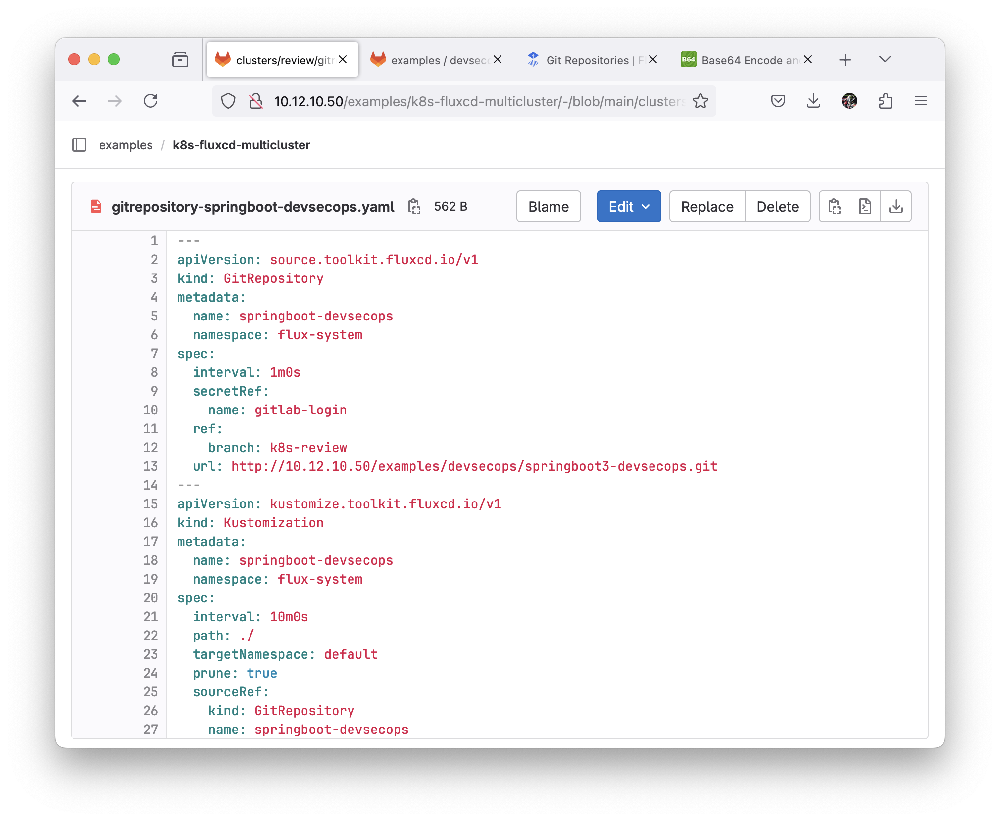

Kemudian coba check dalam kubernetes cluster dengan perintah `kubectl get GitRepository -n flux-system`

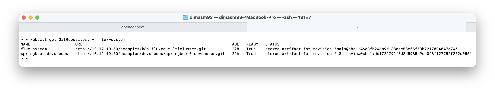

Jika sudah, kita bisa check pada deployment targetnya menggunakan perintah `kubectl get deploy -n <targetNamespace>`