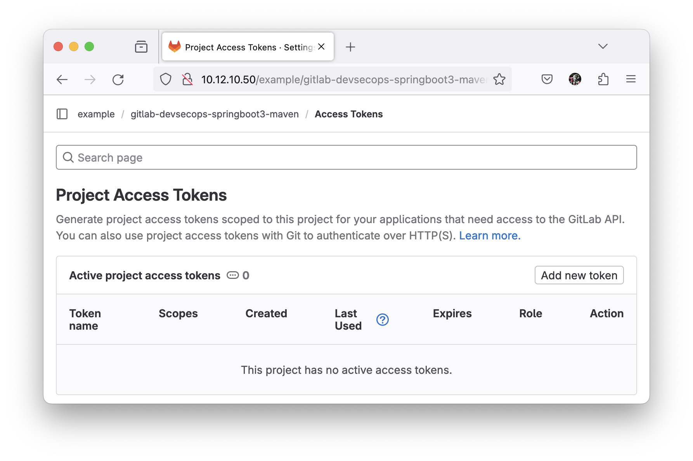
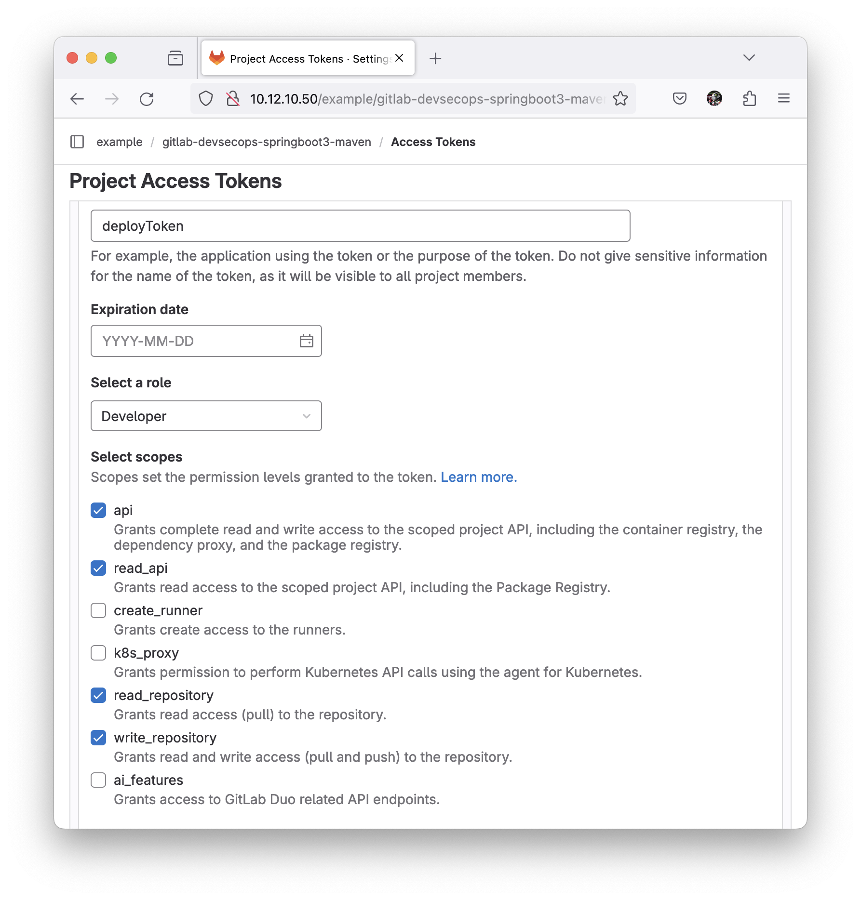
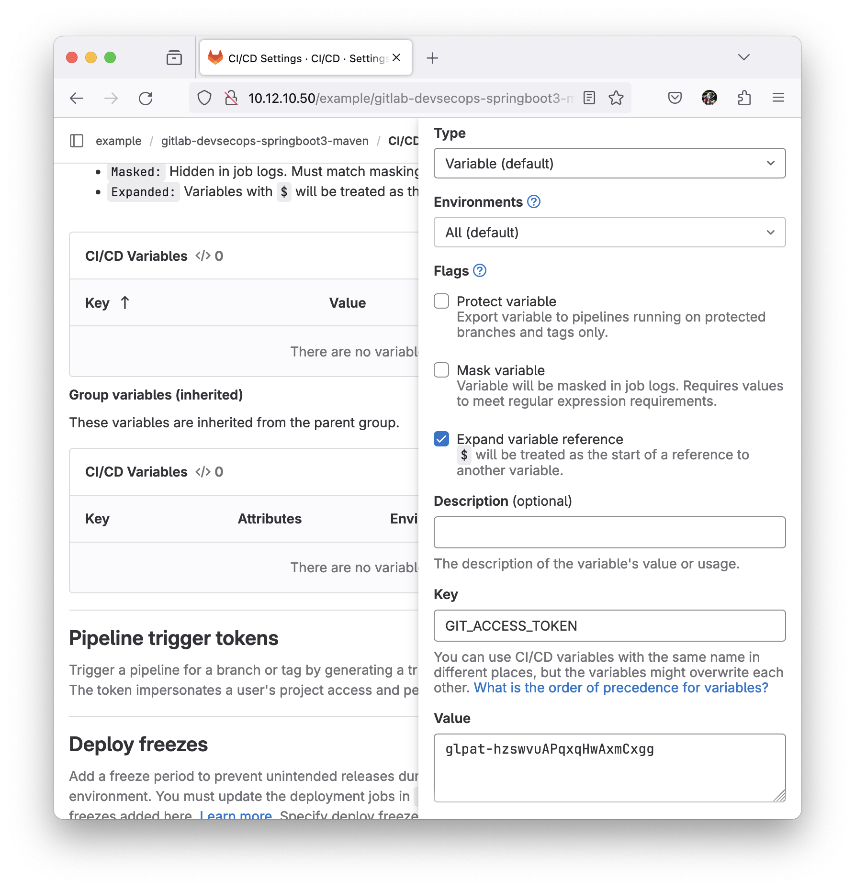

## GitOps Flow

To using git-ops flow, here is step-by-step to implemented git-ops flow

1. Create Personal Access token on project level:

    - Goto menu -> Settings -> Access Tokens, look like this:

        

    - here is the specification: 

        ```yaml
        name: deployToken
        expirationDate: '' # empty value
        role: Developer
        scopes: ['read-api', 'read-repository', 'write-repository']
        ```
        
        look like this: 

        

    - Then set the token to CI/CD Variable with name `GIT_ACCESS_TOKEN` look like this:

        

2. Import the template into your `.gitlab-ci.yaml`

    ```yaml
    include:
        - remote: 'https://raw.githubusercontent.com/dimMaryanto93/gitlab-devops-automation/gitlab-kas/templates/gitops-flow.gitlab-ci.yml'

    deploy-k8s-review:
        stage: deploy
        variables:
            GIT_REMOTE_BRANCH: k8s-review
            KUBERNETES_MANIFEST_TEMPLATES:
                src/kubernetes/overlays/ci # changed to your location of kubernetes manifest
        environment:
            name: review/$CI_COMMIT_REF_SLUG
            url: http://10.12.1.202:30001 # changed to your environment
        extends: .kustomize-build
        resource_group: deploy/review
        after_script:
            - echo $CI_ENVIRONMENT_URL > environment_url.txt
        artifacts:
            paths:
                - environment_url.txt
    ```